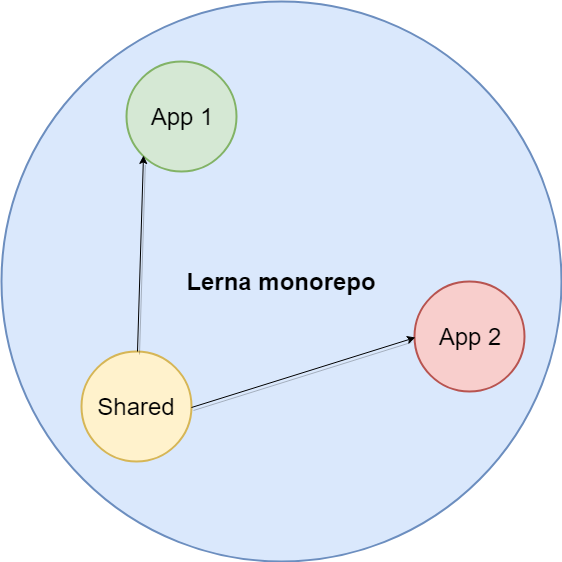

# Lerna experiment

## The main idea

The main idea is to have monorepo with all Eagle projects inside one repository

This approach allows:

* simplify dependencies management process
* share common modules/components via project
* simplify test process

## To start project:
* `npm install --global lerna`
* `npm install`
* `npm run bootstrap --stream --hoist`
* `npm run packagr --stream`

**Note:** For extended commands via Makefile see `CONTRIBUTING.md`.


## Project structure

```
|__ node_modules                  * hoisted common npm modules
|__ packages                      * lerna packages
    |__ eagle-app-reports         * lerna scope (A)
    |     |__node_modules         * link to common npm modles
    |__ eagle-app-insights        * lerna scope (B)
    |     |__node_modules         * link to common npm modles
    |__ eagle-app-splash-page     * lerna scope (C)
    |     |__node_modules         * link to common npm modles
    |__ ...
    |__ eagle-lib-components      * lerna scope (D). Shared Angular modules 
    |     |__ module-1            * Ng module
    |     |__ module-n
    |     |__ ...
    | 
    |__ eagle-lib-scripts          * lerna scope (E). Shared-libs not angular libs       
    |     |__ shared-sript-modules * not angular modules
    |     |__ shared-script        * not angular libs
    |     |__ shared-js-lib
    |
    |__ eagle-server-static        * lerna scope (F). Prod subdomain POC demo server.
    |__ ...                        * finale AOT build of all the apps
```



## To serve app:
 
```
lerna run start --stream --scope <app-name>
```

## Build apps:

* Build all apps: 
```
lerna run build  --stream
```
* Build certain app: 
```
lerna run build --stream --scope <app-name>
```

## Publish apps:

* Publish all apps: 
```
lerna publish
```
* Publish certain app:
```
lerna publish --stream --scope <app-name>
```

## Lerna add module

```
lerna add <package>[@version] [--dev]
```
Example: 
```
lerna add module-1 --scope=module-2 # Install module-1 to module-2
```

## Lerna clean all node_modules

```
lerna clean
```

